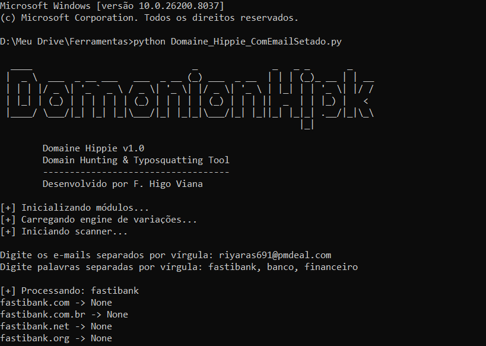

<h1 align="center">🧠 Domaine Hippie</h1>

<p align="center">
  🔍 Domain Hunting | 🛡️ Typosquatting Detection | 📡 Threat Intelligence
</p>

<p align="center">
  Ferramenta para identificação de domínios suspeitos baseada em variações de palavras-chave.
</p>

---

### 🚀 Sobre a Ferramenta

- 🔎 Geração automática de variações de domínio (typosquatting)
- 🌐 Teste de disponibilidade via HTTP e HTTPS
- 📊 Exportação dos resultados em CSV
- 📧 Envio de alertas por e-mail
- 🧠 Suporte a múltiplas palavras-chave

---

### 🖼️ Demonstração

<p align="center">
  
</p>

---

### 🔐 Configuração Obrigatória (E-mail)
<p>Para que o envio de alertas funcione, o Google e outros provedores exigem o uso de uma Senha de Aplicativo. Você não deve usar sua senha convencional do e-mail no script.<p>
- Acesse as configurações da sua Conta Google.
- Ative a Verificação em duas etapas.
- Pesquise por "Senhas de app".
- Gere uma nova senha para "E-mail" e copie o código de 16 dígitos gerado.
- No script: Utilize essa senha de 16 dígitos na variável de autenticação SMTP.

---

### ⚙️ Tecnologias Utilizadas

<div align="center">


</div>

---

### ▶️ Como usar

```bash
python domaine_hippie.py

Digite os e-mails separados por vírgula:
teste@gmail.com, outro@email.com

Digite palavras separadas por vírgula:
fastibank, banco, financeiro

fast1bank.com -> 200
fastibank.xyz -> None